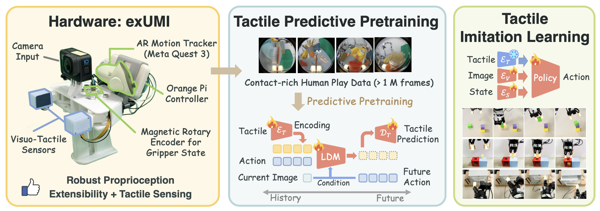
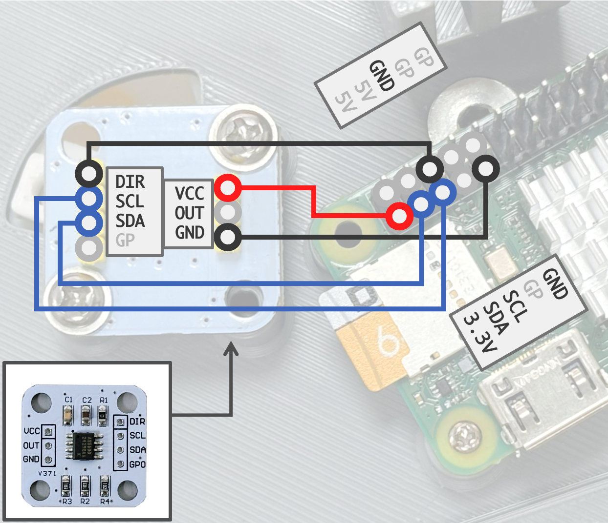

# exUMI

[[Project page]](https://silicx.github.io/exUMI/)
[[Paper]](https://arxiv.org/abs/2509.14688)
[[Code]](https://github.com/silicx/exUMI/tree/main)

[Yue Xu](https://silicx.github.io/),
Litao Wei,
Pengyu An, 
Qingyu Zhang
[Yong-Lu Li](https://dirtyharrylyl.github.io/),

## Hardware

Please go to our [project page](https://silicx.github.io/exUMI/) for 3D printing CAD models and the assembly guide.

## Data Collection

### Calibrate Your Device

**ARCap APK**: Install the apk ([here]./ARCap/arcap_exUMI_release.apk) to the Meta Quest (refer to the installation guide from [ARCap](https://stanford-tml.github.io/ARCap/))

**RaspberryPi / OrangePi**:
1. Install any OS on the RaspberryPi / OrangePi and setup the network. A static IP is suggested for convienience
2. Clone this repo to the Pi and setup the environment. Turn on the I2C port in the board cofiguration (`raspi-config` or `orangepi-config`)
3. Connect the power wires of tactile sensors to the 5V and GND pins on the board. Connect the AS5600 board as below.

**Tactile Sensor**:
1. `cd ./9DTact/shape_reconstruction`
2. Setup the tactile sensors' camera channel in `shape_config_left.yaml` and `shape_config_right.yaml`.
3. Calibrate the tactile sensors: `sh run_calibration.sh left`, `sh run_calibration.sh right`
4. Copy the 

**AS5600 Encoder**: `cd ARCap && python calibrate_as5600.py`

### Data Collection and Post-processing

See [Data Collection](./DATA_COLLECTION.md) page for details.

## Real-world Evaluation

Please refer to `./sh/` for the policy training and real world deployment script (on Flexiv Rizon + Grav hardware).

## Acknowledgement

We appreciate the great efforts from [UMI](https://umi-gripper.github.io/), [9DTact](https://linchangyi1.github.io/9DTact/) and [ARCap](https://stanford-tml.github.io/ARCap/), which build a solid foundation for our work!
